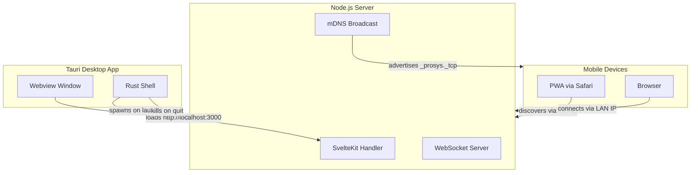

# Platform Architecture

How ProSys runs on desktop (Tauri) and mobile (PWA), with auto-discovery via mDNS.

## Overview



The host Mac runs a Tauri desktop app that embeds a webview. Under the hood, a Node.js server handles SvelteKit SSR, WebSocket connections, and mDNS broadcasting. Mobile devices discover the server automatically and access it through Safari or as an installed PWA.

## Dev Mode

Command: `pnpm tauri dev`

1. Tauri CLI runs `beforeDevCommand` (`pnpm dev --host`), which starts the Vite dev server on `0.0.0.0:5173`
2. The Vite plugin (`prosysWs` in `vite.config.ts`) attaches the WebSocket server and starts mDNS broadcast
3. Tauri compiles the Rust code and opens a native window pointing to `http://localhost:5173`
4. Hot module replacement works as usual -- changes appear instantly in the Tauri window

## Production Mode

Command: `pnpm tauri build` (produces a macOS `.app` bundle)

On app launch:

1. The Rust shell (`src-tauri/src/lib.rs`) spawns `node server.js` with `PORT=3000` and `HOST=0.0.0.0`
2. It polls `localhost:3000` until the server is ready (up to ~10 seconds)
3. The Tauri window navigates to `http://localhost:3000`
4. `server.js` serves the SvelteKit app, handles WebSocket upgrades on `/ws`, and broadcasts mDNS

On app quit:

1. The `WindowEvent::Destroyed` handler kills the Node.js child process
2. `server.js` graceful shutdown unpublishes mDNS and closes all WebSocket connections

## Key Files

| File | Purpose |
|------|---------|
| `server.js` | Production server entry point (HTTP + WebSocket + mDNS) |
| `src-tauri/src/lib.rs` | Rust code that spawns/kills the Node.js sidecar |
| `src-tauri/tauri.conf.json` | Tauri configuration (window, build commands, CSP) |
| `vite.config.ts` | Dev server plugin (WebSocket + mDNS broadcast) |
| `static/manifest.json` | PWA manifest for mobile "Add to Home Screen" |
| `src/app.html` | HTML template with PWA meta tags |

## mDNS Discovery

Service type: `_prosys._tcp`

The server broadcasts itself via Bonjour/mDNS so devices on the LAN can find it without knowing the IP. To verify:

```bash
dns-sd -B _prosys._tcp
```

Both the Vite dev server and the production `server.js` broadcast mDNS.

## PWA (Mobile)

The PWA manifest (`static/manifest.json`) enables iOS Safari's "Add to Home Screen":

- `display: standalone` -- no Safari chrome, app-like experience
- `theme_color: #4a7c59` -- matches the app's green theme
- Apple-specific meta tags in `app.html`: `apple-mobile-web-app-capable`, `apple-mobile-web-app-status-bar-style`, `apple-touch-icon`

## Network

The server always binds to `0.0.0.0` (all interfaces), not just `localhost`. This allows any device on the LAN to connect by the host's IP address:

- Dev: `http://<host-ip>:5173`
- Prod: `http://<host-ip>:3000`

## WebSocket Sharing

Both the Vite dev plugin and `server.js` use the same `globalThis.__wsClients` Map for the WebSocket client registry. This means the SvelteKit API routes' `broadcast()` function (in `src/lib/server/ws.ts`) works identically in dev and production -- it reads from the same global regardless of who set up the WebSocket server.
